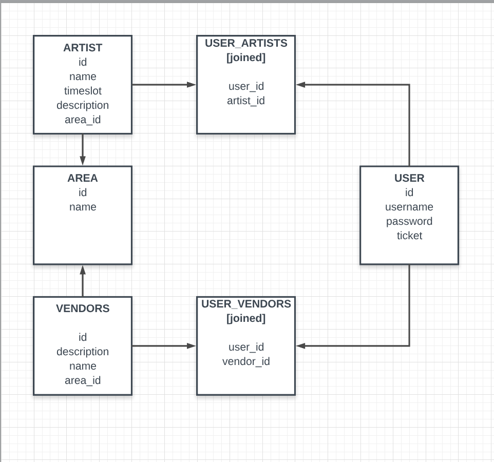

# codechella
A sample music festival page using React/Express front/back-end.

### Back-End Construction

_[fig. 1] Database Format in PostgreSQL_

The back-end for this project is constructed with _PostgreSQL_ for the database, as well as _Express_ and _Sequelize_ for the server.

Each __area__ has several __artists__, as well as several __vendors__. A given __user__ can save their favorites of any of these categories.

## Views / Component Hierarchy

### MVP

#### Navigation Bar
- contains _Home_, _Artists_, _Vendors_, _Areas_ as well as a _Login/Register_

#### Artists
- _ArtistList_: list of _Artist_ components
- _Artist_: rendered version of _Artist_ entries
- _ArtistView_: class component for artists
- _ArtistForm_: form for adding artists
- _ArtistModal_: modal details about artist

#### Vendors
- _VendorList_: list of _Vendor_ components
- _Vendor_: rendered version of _Vendor_ entries
- _VendorModal_: modal details about vendor
- _VendorForm_: form for adding vendors
- _VendorView_: class component for vendors

#### Areas
- _Area_: Picture, description.
- _AreaModal_: modal details about area
- _AreaList_: list of _Area_ components, to switch between different Areas
- _AreaView_: class component for areas

#### Login/Register
- _LoginForm_: Login option.
- _RegisterForm_: Register option.
_ _LoginView_: View of the above two options.
- _ProfileView_: Conditional render view for favorites.
- _ProfileModal_: User information, favorite artists and vendors with option of delete from user's profile.

#### Footer

#### Timeline
1. Monday
  1. seed.js
  2. resetDb.js
  3. models.js
  4. server.js
  5. routes
    1. Users (artists, vendors, areas)
    2. Artists
    3. Vendors
    4. Areas
2. Tuesday
  1. Artists View
  2. Vendors View
  3. Area View
  4. Navigation
3. Wednesday (MVP)
  1. Login/Register
  2. Styling
4. Thursday
  1. Map
  2. Tickets
  3. Styling

#### Code Snippet
```javascript
 import React, { Component } from 'react';
import ArtistList from './ArtistList';
import ArtistModal from './ArtistModal';
import ArtistForm from './ArtistForm';
import './ArtistList.css';

export default class ArtistView extends Component {
  constructor(props) {
    super(props);
    this.state = {
      artist: null
    }
    this.handleModal = this.handleModal.bind(this);
    this.resetModal = this.resetModal.bind(this);
  }

  handleModal(e) {
    let { id } = e.target.parentNode;
    const artist = this.props.artists.filter(artist => artist.name.toLowerCase() === id.toLowerCase())[0];
    this.setState({artist});
  }

  resetModal() {
    this.setState({artist: null});
  }

  render() {
    return (
      <div>
      <h2 className="header">LINEUP</h2>
      {!this.state.artist ?
        <ArtistList
          artists={this.props.artists.filter(artist => artist.created_by <= 3)}
          onChange={this.handleModal}
          favoriteArtist={this.props.favoriteArtist}
          unfavoriteArtist={this.props.unfavoriteArtist}
          userArtists={this.props.userArtists}
          creator={this.props.creator}
          delete={this.props.delete}
          update={this.props.update}/> :
        <ArtistModal
          artist={this.state.artist}
          reset={this.resetModal}/>}
      <h2 className="header">WILDCARDS</h2>
        <ArtistList
          artists={this.props.artists.filter(artist => artist.created_by > 3)}
          onChange={this.handleModal}
          favoriteArtist={this.props.favoriteArtist}
          unfavoriteArtist={this.props.unfavoriteArtist}
          userArtists={this.props.userArtists}
          creator={this.props.creator}
          delete={this.props.delete}
          update={this.props.update}/>
          <ArtistForm
            artists={this.props.artists}
            submit={this.props.submit}
            />
      </div>
    )
  }
}
```
The significance of this code snippet lies in the filter method and the creator prop for the ```<ArtistList />``` component. It determines whether or not a user is an admin/creator (if their id is less than 4, since we have three admin users, or if their id matches the created_by id) and it renders to the screen split between admin-created options and user-created options. The delete method also relies on this id match up.
